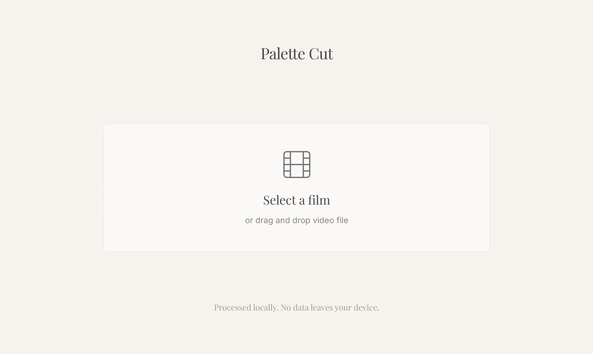
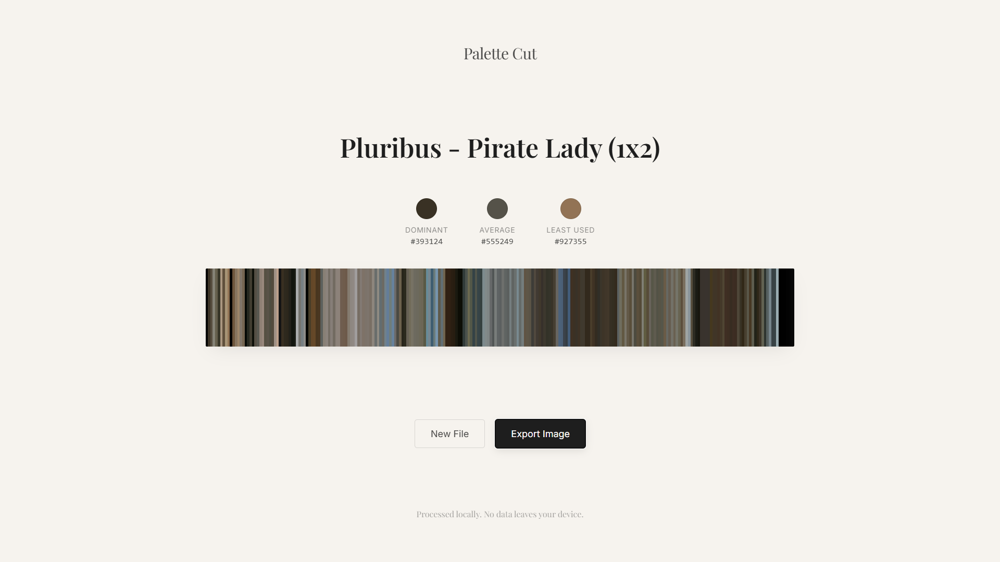

# Palette Cut

Palette Cut is a client-side film color visualizer that distills an entire movie or short film into a single continuous color strip.

By sampling frames across the full duration of a video, the project creates a minimal, gallery-style representation of a film’s chromatic identity.






## Features

- 100% client-side processing (no uploads, no backend)
- Single-line color palette representing the entire film
- Editable film title
- Dominant and least-used color detection
- Exportable image for sharing
- Privacy-first: files never leave your device

## Tech Stack

- React + Vite
- HTML5 Video & Canvas API
- Tailwind CSS
- html2canvas
- ffmpeg.wasm
## Design Philosophy

Palette Cut is designed as a digital art object rather than a traditional analytics tool.
The interface is intentionally minimal, allowing the film’s colors to be the focus.

## Running Locally

```bash
git clone https://github.com/KartikeyaKotkar/palette-cut.git
cd palette-cut
npm install
npm run dev
